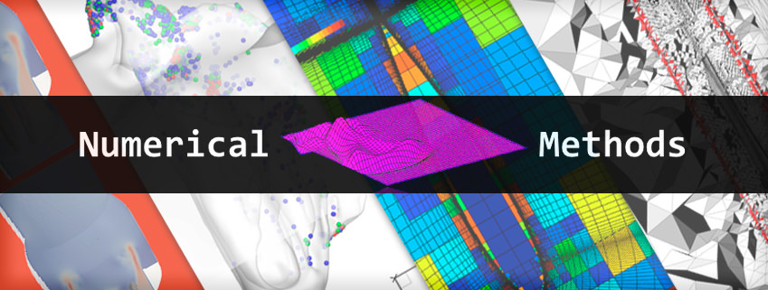

# Introduction to Numerical Methods
Offical Repository of RMUTT 09114222 Introduction to Numerical Methods

Lecturers:
 - Wongwisarut Kuangsatung, Asst. Prof. Dr.
 - Ratthaprom Promkam, Dr. rer. nat.




## Schedules

SEMESTER 1/2568

| Section | Date    | Lecture  | Workshop | MS-Team Code | [D-Learn](https://dlearn.rmutt.ac.th/course/view.php?id=2318) Key |
|---------|---------|----------|----------|--------|---------|
|  SEC01  | อังคาร     |ST1-905 เวลา 08.00 - 10.00 | ST1-905 เวลา 10.00 - 12.00 | `huahoax` |  N/A  |


## Examinations

| Section | MIDTERM | FINAL  | Location|
|---------|---------|-------|---------|
| SEC 01 | 3 กันยายน 2568 เวลา 09.00 - 12.00 | 29 ตุลาคม 2568 เวลา 09.00 - 12.00 | ST1-905 |


## Course Description

การวิเคราะห์ความคลาดเคลื่อน การหาผลเฉลยของสมการไม่เชิงเส้นโดยวิธีแบ่งคร่ึงช่วง วิธีวางผิดที่ วิธีทําซํ้า วิธีนิวตัน วิธีซีแคนต์ และอื่น ๆ ผลเฉลยของระบบ สมการเชิงเส้น การประมาณค่าในช่วง การประมาณค่าแบบกําลังสองน้อยสุด การหาอนุพันธ์เชิงตัวเลข การหาปริพันธ์เชิงตัวเลข การพัฒนาแอพพลิเคชั่นในการแก้ปัญหา ด้วยระเบียบวิธีเชิงตัวเลขเบื้องต้น และปฏิบัติการที่เกี่ยวข้อง
          
Error analysis, solutions of nonlinear equations with bisection method, regular false method, iterative method, Newton method, secant method, solutions of linear equations, interpolations, least square approximations, numerical differentiations, numerical integrations, elementary application development for solving problems with numerical methods and related laboratory

## Course Learning Outcomes

1. บอกความหมายของความคลาดเคลื่อนได้ 
1. คำนวณผลเฉลยของสมการไม่เชิงเส้นโดยวิธีแบ่งครึ่งช่วง วิธีวางผิดที่ วิธีทำซ้ำ วิธีนิวตัน วิธีซีแคนต์ได้ 
1. คำนวณผลเฉลยของระบบสมการเชิงเส้นได้
1. คำนวณการประมาณค่าในช่วงด้วยวิธีนิวตันและวิธีลากรองจ์ได้
1. คำนวณการประมาณค่าแบบกำลังสองน้อยสุดได้
1. คำนวณค่าอนุพันธ์เชิงตัวเลขได้
1. คำนวณค่าปริพันธ์เชิงตัวเลขได้
1. เขียนโปรแกรมคอมพิวเตอร์ในการคํานวณด้านระเบียบวิธีเชิงตัวเลขเบื้องต้นได้

## Class Materials

|    Topic   |   Description   |    Materials and Workshops   |
|------------|-----------------|---------------|
| Course Syllabus      |  ประมวลรายวิชา | [Document](./materials/cs.pdf)|
| [Erorrs and Approximation](./materials/lecture_01.pdf) | ค่าคลาดเคลื่อนและค่าประมาณ | [Lecture](./materials/handout_01.pdf) <br> [Workshop 01](./materials/workshop_01.ipynb) |
| [Root Finding](./materials/lecture_02.pdf) | รากของสมการ | [Lecture](./materials/handout_02.pdf) <br> [Workshop 02](./materials/workshop_02.ipynb) <br>  [Workshop 03](./materials/workshop_03.ipynb)|
| [Systems of Linear Equations](./materials/lecture_03.pdf) | ระบบสมการเชิงเส้น | [Lecture](./materials/handout_03.pdf) <br> [Workshop 04](./materials/workshop_04.ipynb) <br> [Workshop 05](./materials/workshop_05.ipynb) <br> [Workshop 06](./materials/workshop_06.ipynb) <br> [Workshop 07](./materials/workshop_07.ipynb)|
| [Regression](./materials/lecture_04.pdf) | สมการถดถอย | [Lecture](./materials/handout_04.pdf) <br> [Workshop 08](./materials/workshop_08.zip) <br> [Workshop 09](./materials/workshop_09.zip) |
| [Interpolation](./materials/lecture_05.pdf) | การประมาณค่าในช่วง | [Lecture](./materials/handout_05.pdf) <br> [Workshop 10](./materials/workshop_10.ipynb) <br> [Workshop 11](./materials/workshop_11.zip) |
| [Numerical Differentiation and Integration](./materials/lecture_06.pdf) | อนุพันธ์เชิงตัวเลข | [Lecture](./materials/handout_06.pdf) <br> [Workshop 12](./materials/workshop_12.ipynb) <br> [Workshop 13](./materials/workshop_13.ipynb) |


## Grades

คะแนนเต็ม 100 คะแนน โดยแบ่งออกเป็น
- การสอบกลางภาค 25%
- การสอบปลายภาค 25%
- การสอบย่อย 25%
- งานที่ได้รับมอบหมาย 25%

หากนักศึกษาเข้าเรียนน้อยกว่า 80% ของเวลาเรียนทั้งหมด
หรือได้คะแนนรวมน้อยกว่า 50% ของคะแนนเต็ม นักศึกษาจะไม่ผ่านในรายวิชานี้ และได้รับการบันทึกผลการเรียน F (เกรด 0.0) 

สำหรับนักศึกษาที่ผ่านเกณฑ์ดังกล่าว จะได้รับการบันทึกผลการเรียนตามเกณฑ์ของคะแนน t-score 

```
t-score = 50 + 10*(x - u)/s
```
เมื่อ x คือคะแนนรวม, u คือคะแนนเฉลี่ยของคะแนนรวม และ s คือส่วนเบี่ยงเบนมาตรฐานของคะแนนรวม

ดังนี้

| ผลการเรียน | เกรด | เกณฑ์ t-score |
|---------|------|--------------|
| F | 0.00 | (-Inf, 50) | 
| D | 1.00 | [50, 55) | 
| D+ | 1.50 | [55, 60) | 
| C | 2.00 | [60, 65) |
| C+ | 2.50 | [65, 70) |
| B | 3.00 | [70, 75) |
| B+ | 3.50 | [75, 80) |
| A | 4.00 | [80, Inf) |

## References

- Burden, R. L., & Faires, J. D. (2010). Numerical Analysis (9 edition). Cengage Learning.
- Sauer, T. (2011). Numerical Analysis (2nd edition). Pearson.
- Chapra, S. C., & Canale, R. P. (2021). Numerical Methods for Engineers (8th edition). McGraw-Hill.
- ปราโมทย์ เดชะอำไพ และนิพนธ์ วรรณโสภาคย์, (2010) ระเบียบวิธีเชิงตัวเลขในงานวิศวกรรม, สำนักพิมพ์จุฬาลงกรณ์มหาวิทยาลัย
- วรสิทธิ์ กาญจนกิจเกษม, (2014) ระเบียบวิธีเชิงตัวเลข, สำนักพิมพ์จุฬาลงกรณ์มหาวิทยาลัย
- Heath, M. T. (2018). Scientific Computing: An Introductory Survey (Revised 2nd edition). Society for Industrial and Applied Mathematics (SIAM).